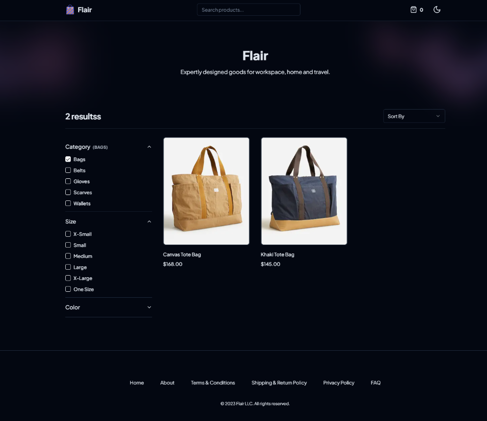
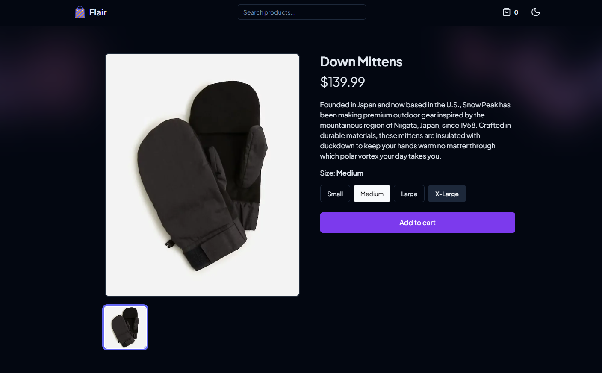
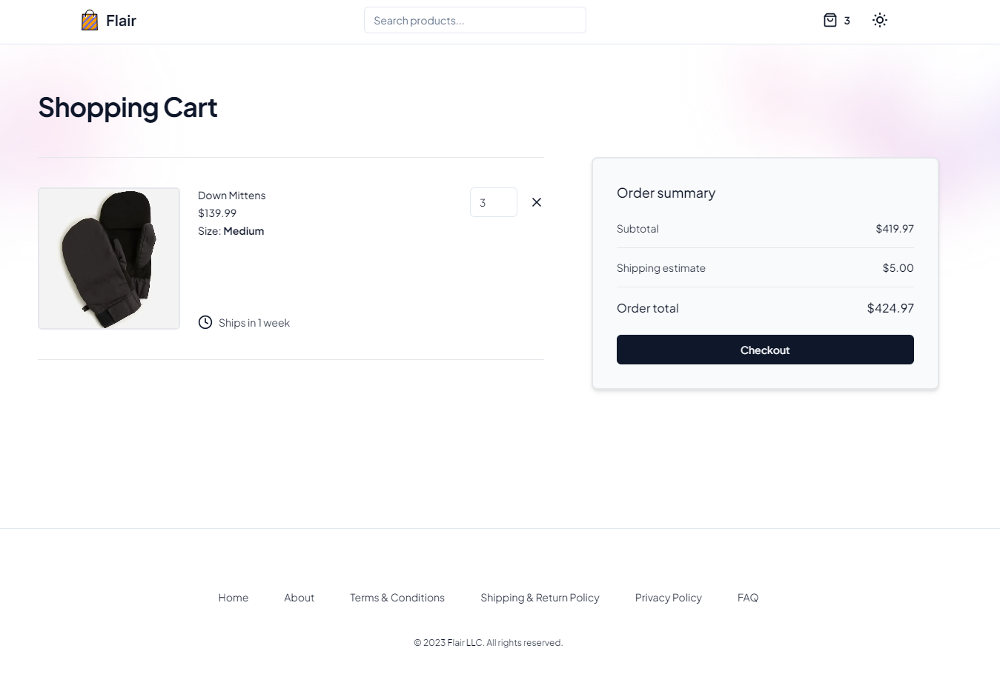
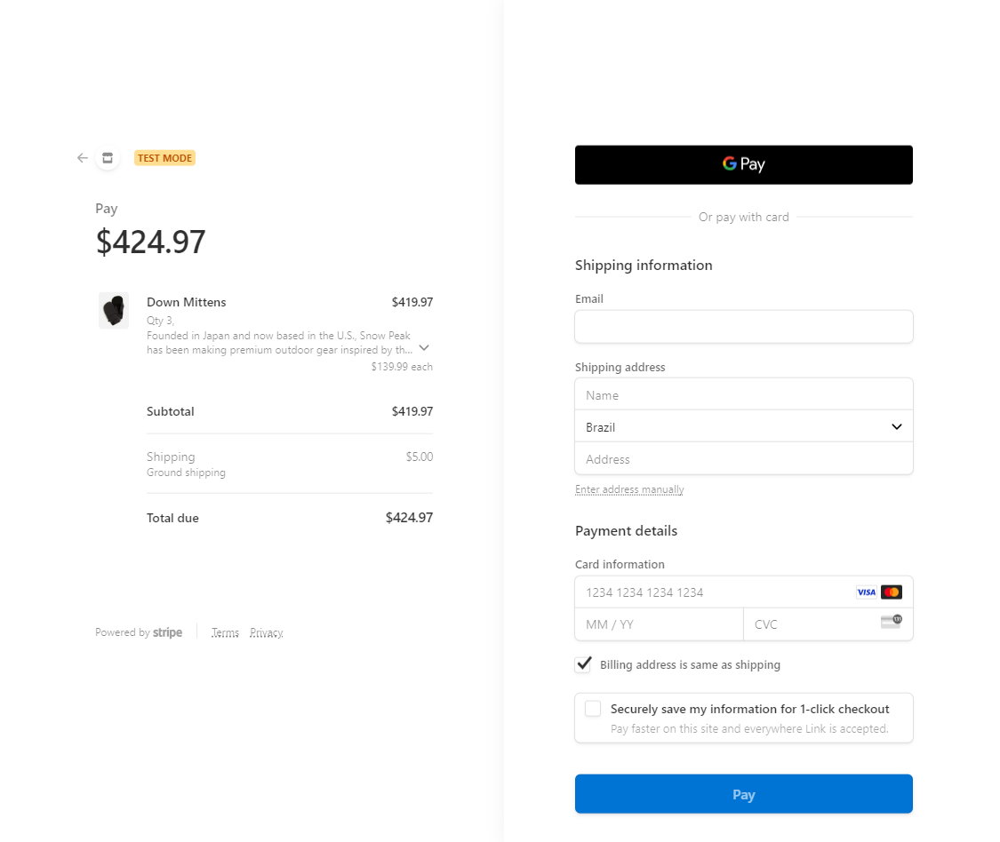
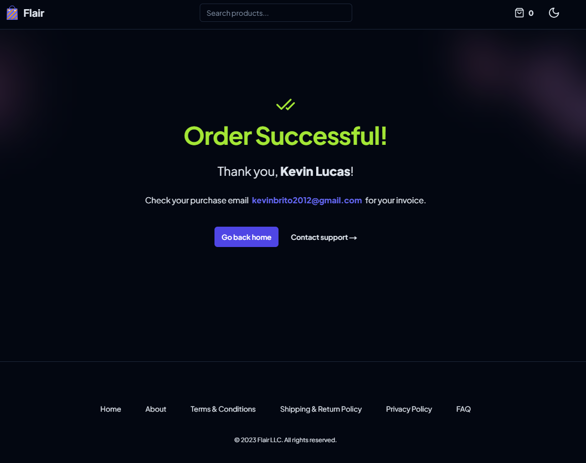

# Flair Ecommerce App 🛒

Welcome to the E-Commerce App project! This application offers users a seamless shopping experience
by enabling them to effortlessly search, explore, and purchase a wide range of products.
The app is built using the cutting-edge technologies of Next.js, Tailwind CSS, and TypeScript,
ensuring a responsive and user-friendly interface. Dive into the world of online shopping and discover the extensive
collection of products available on our platform. To see it in action, simply visit our live site at [here](https://ecommerce-app-alpha-seven.vercel.app/).
Happy shopping!


### 🛠 Technologies Used
The project was built using the following technologies:

* [Next.js](https://nextjs.org/)
* [TailWind CSS](https://tailwindcss.com/)
* [TypeScript](https://www.typescriptlang.org/)
* [Sanity](https://www.sanity.io/)
* [Stripe API](https://stripe.com/)

# 📌 Prerequisites
Before you begin, ensure you have the following tools installed:

* [Git](https://git-scm.com/)
* [Node.js](https://nodejs.org/en)
* A code editor such as [VSCode](https://code.visualstudio.com/)

### 🚀 Getting Started

1. Clone this repository:
```bash
git clone https://github.com/kevin504-max/ecommerce-app.git
```

2. Navigate to the project directory:
```bash
cd ecommerce-app
```

3. Install the dependencies:
```bash
npm install
```

4. Create a `.env.local` file in the root directory of the project and add the following environment variables:
```bash
NEXT_PUBLIC_SANITY_PROJECT_ID=your_project_id
NEXT_PUBLIC_SANITY_DATASET=your_dataset_name
NEXT_PUBLIC_STRIPE_PUBLIC_KEY=your_stripe_publishable_key
STRIPE_SECRET_KEY=your_stripe_secret_key
```

5. Run the development server:
```bash
npm run dev
```

6. Open [http://localhost:3000](http://localhost:3000) with your browser to see the result.

### ✅ Features

- Filter and sort products
- Search products by name
- View product details
- Select sizes and quantities
- Add products to the cart
- Remove products from the cart
- Make secure payments with the Stripe API

### 📸 Screenshots











# 🤝 Contribuitions

Feel free to contribute to this project by creating pull requests or submitting issues if you encounter any problems.

### 🧠 Acknowledgements
This project was made possible with the support of the following technologies:

- [Next.js](https://nextjs.org/)
- [TailWind CSS](https://tailwindcss.com/)
- [TypeScript](https://www.typescriptlang.org/)
- [Sanity](https://www.sanity.io/)
- [Stripe API](https://stripe.com/)

Thank you for choosing our E-Commerce App for your shopping needs! Discover the vast array of products available on
our platform and relish the convenience of seamless shopping. 🛍️🛒
